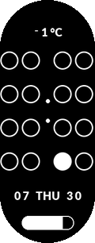

# Binary watchface

A minimal binary watch face for Xiaomi Smart Band 10.

<p align="center">
  
  <br>
  <sub>212 × 520 px display · 46.57 × 22.54 mm band body</sub>
</p>

<p align="center">
  <a href="https://buymeacoffee.com/jadegopher">
    
  </a>
</p>

## Reading the time

The four columns represent the digits of 24-hour time (`HHMM`). Read each
column from top to bottom using the values `8`, `4`, `2`, and `1`:

- Filled circle: `1`
- Empty circle: `0`

Add the filled values in each column to get its digit. The colon separates
hours from minutes. The face also shows temperature, date, weekday, and
battery level.

## Install

1. Download the latest `wf_pack.bin`.
2. Connect the Xiaomi Smart Band 10 to an Android phone.
3. Install a compatible third-party app such as
   [Notify for Xiaomi](https://play.google.com/store/apps/details?id=com.mc.xiaomi1&hl=en).
4. Open **Watchfaces** and select **Install private watchface**.
5. Choose `wf_pack.bin` and install it.

Third-party installation is unofficial. App menus and compatibility may
change between versions.

## Build

Python and Pillow are required. Generate the JSON definition and all normal
and AOD resources, then run the GMF packer:

```powershell
python generate_assets.py
.\WatchfacePackTool64.exe
```

The watch face uses Lato Black; `Lato-Black.ttf` must remain beside the
generator. Every visual component is rendered at 4× resolution and
downsampled for smoother edges.

## Project notes

- Display: `212 × 520`
- Device: Xiaomi Smart Band 10
- Definition: `wfDef.json`
- Normal resources: `images`
- AOD resources: `images_aod`
- Compiled output: `wf_pack.bin`

Temperature uses GMF's signed numeric widget with live source `2031`.
Unavailable-weather presentation is controlled by the Band firmware and the
phone's supplied weather state.
